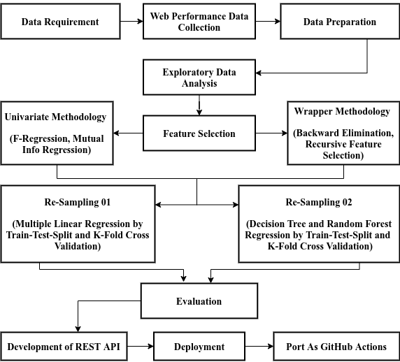

# ux-reporter-research-experiments

Collection of experiments of my undergrad final thesis. In this research, I have worked on measuring the impact of web performance issues on visual progression based user experience under the supervision of Md. Anwar Hossen (@mahemon), Lecturer, Department of Software Engineering, Daffodil International University.

## Methodology

This is a quantitative research which includes stages like:

- Data Collection
- Data Wrangling
- Feature Selection
- Machine Learning Experiments
- Development of REST API
- Development of a GitHub Actions

